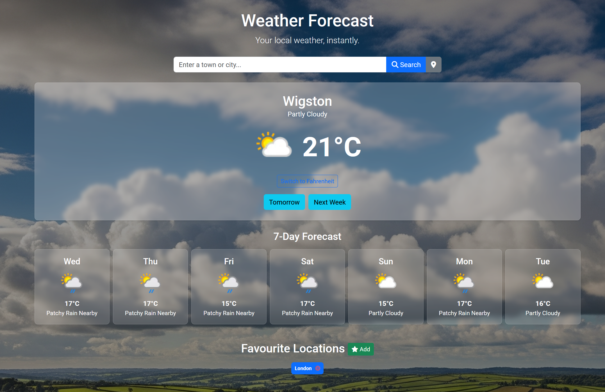

# UK Weather Forecast Application

A responsive, single-page web application that provides current weather information, daily and weekly forecasts. It allows users to search for locations, use their current geolocation, and save their favourite places.



### [Live Demo Link (https://jsweatheruk.netlify.app)](https://jsweatheruk.netlify.app)

---

## Features

* **Current Weather**: View the current temperature, description, and weather icon for a chosen location.
* **Location Search**: Look up weather by typing in any town or city.
* **Geolocation**: Instantly see the weather for your current location with a single click.
* **Unit Toggling**: Switch the temperature display between Celsius (default) and Fahrenheit.
* **Forecasts**: View the forecast for the next day or a 7-day outlook.
* **Favourite Locations**: Save and manage a list of favourite locations using browser `localStorage`.
* **Dynamic UI**: The background image changes to reflect the current weather conditions.
* **Responsive Design**: A clean and clear user interface that works seamlessly on both desktop and mobile devices.

---

## Technologies Used

* **Front-End**: HTML5, CSS3, JavaScript (ES6+)
* **Styling**: [Bootstrap 5](https://getbootstrap.com/) for responsive layout and components.
* **Icons**: [Font Awesome](https://fontawesome.com/)
* **APIs**: [WeatherAPI.com](https://www.weatherapi.com/) for weather data.
* **Deployment**: [Netlify](https://www.netlify.com/)
* **Backend**: [Netlify Functions](https://docs.netlify.com/functions/overview/) for secure API key management.

---

## Local Setup and Installation

To run this project on your local machine, follow these steps.

1.  **Clone the repository:**
    ```sh
    git clone [https://github.com/Cboybebop/JS_Weather.git](https://github.com/Cboybebop/JS_Weather.git)
    cd JS_Weather
    ```

2.  **Install Netlify CLI:**
    This tool allows you to run the Netlify environment (including functions) locally.
    ```sh
    npm install -g netlify-cli
    ```

3.  **Install project dependencies:**
    This will install the `node-fetch` package required by the Netlify function.
    ```sh
    npm install
    ```

4.  **Create an environment file:**
    Create a file named `.env` in the root of your project and add your API key from WeatherAPI.com. The Netlify CLI will automatically use this file for local development.
    ```
    # .env
    WEATHERAPI_API_KEY=your_actual_api_key_here
    ```

5.  **Run the local development server:**
    ```sh
    netlify dev
    ```
    Your application will now be running on `http://localhost:8888`.

---

## Deployment

This project is configured for one-click deployment to Netlify.

1.  Push your code to a GitHub repository.
2.  Connect the repository to a new site on Netlify.
3.  Set the required environment variable in the Netlify UI:
    * Go to **Site settings > Build & deploy > Environment**.
    * Add a variable with the **Key** `WEATHERAPI_API_KEY` and your WeatherAPI.com API key as the **Value**.

Netlify will automatically detect the `netlify.toml` file and deploy the site along with the serverless function.